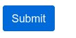

=== Button

"a *button* refers to any graphical control element that provides the user a simple way to trigger an event,
like searching for a query at a search engine, or to interact with dialog boxes, like confirming an action."
-- Wikipedia definition

[cols="3,3,3", options="header"]
|===
|States
|Properties
|Intentions

|
|text
|
|===

Usage example :
[source,groovy,indent=0]
[subs="verbatim,attributes"]
----
include::{codepath}/../../../../test/groovy/sc/tyro/doc/componentsTest.groovy[tags=button]
----
