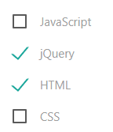

=== CheckBox

"a *checkbox* is a small box that, when selected by the user, shows that a particular feature has been enabled
  or a particular option chosen. Check boxes are commonly used when more than one option may need to be selected."
-- inspired from Oxford dictionaries definition

[cols="3*", options="header"]
|===
|States|Properties|Intentions

|checked
|label
|check

|unchecked
|
|uncheck
|===

Usage example : TODO
[source,groovy,indent=0]
[subs="verbatim,attributes"]
----
include::{codepath}/../../../../test/groovy/sc/tyro/doc/componentsTest.groovy[tags=checkbox]
----