==== Field

This is the base component for all types of fields.

[cols="3*", options="header"]
|===
|States|Properties|Intentions

|empty
|text
|fill

|filled
|label
|clear

|readOnly
|placeholder
|

|required
|value
|

|optional
|
|

|valid
|
|

|invalid
|
|
|===

[IMPORTANT]
====
*All following types of fields inherit these states, properties and intentions.*
====

==== TextField

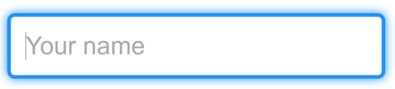

[cols="3*", options="header"]
|===
|States|Properties|Intentions

|
|length
|

|===

"a *textfield* allows the user to enter text information to be used by the program.
It can be a single-line text box when only one line of input is required, and a multi-lines text box if more than one line
of input may be required."
-- inspired from Wikipedia definition

Usage example : TODO
[source,groovy,indent=0]
[subs="verbatim,attributes"]
----
include::{codepath}/../../../../test/groovy/sc/tyro/doc/componentsTest.groovy[tags=textfield]
----

==== ColorField

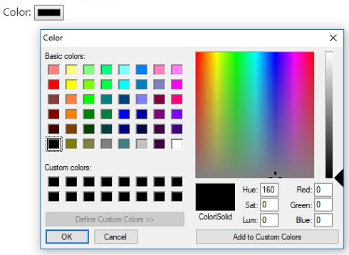

_Definition_: a *colorField* is used for fields that must contain a color.

Usage example : TODO

==== DateTimeField

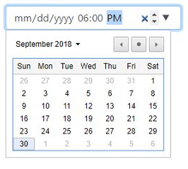

_Definition_: a *dateTimeField* allows the user to enter or select a date and time (with time zone).

Usage example : TODO

==== DateField

//image::../images/components/DateField-1.png[DateField-1, float=left]
//image::../images/components/DateField-2.png[DateField-2, float=left]
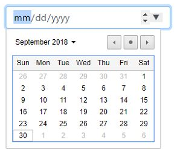

_Definition_: a *dateField* allows the user to enter or select a date.

[cols="3*", options="header"]
|===
|States|Properties|Intentions

|inRange
|maximum
|step

|outOfRange
|minimum
|
|===

Usage example : TODO
[source,groovy,indent=0]
[subs="verbatim,attributes"]
----
include::{codepath}/../../../../test/groovy/sc/tyro/doc/componentsTest.groovy[tags=datefield]
----

==== TimeField

//image::../images/components/TimeField-1.png[TimeField-1, float=left]
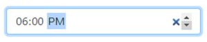

_Definition_: a *timeField* allows the user to select a time (no time zone).

Usage example : TODO

==== MonthField

//image::../images/components/MonthField-1.png[MonthField-1, float=left]
//image::../images/components/MonthField-2.png[MonthField-2, float=left]
image::../images/components/MonthField-3.png[MonthField-3, role=thumb]

_Definition_: a *monthField* allows the user to select a month and year.

Usage example : TODO

==== WeekField

//image::../images/components/WeekField-1.png[WeekField-1]
//image::../images/components/WeekField-2.png[WeekField-2]
image::../images/components/WeekField-3.png[WeekField-3, role=thumb]

_Definition_: a *weekField* allows the user to select a week and year.

Usage example : TODO

==== EmailField

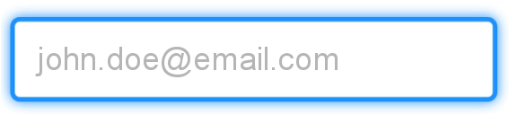

[cols="3*", options="header"]
|===
|States|Properties|Intentions

|
|length
|

|===

_Definition_: an *emailField* is used for fields that must contain an e-mail address.

Usage example : TODO

==== PasswordField

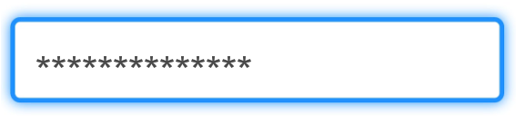

_Definition_: a *passwordField* is used for fields that must contain a password.

[cols="3*", options="header"]
|===
|States|Properties|Intentions

|
|length
|

|===

Usage example : TODO

==== NumberField

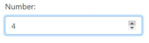

_Definition_: a *numberField* is used for fields that must contain a numeric value.

[cols="3*", options="header"]
|===
|States|Properties|Intentions

|inRange
|maximum
|step

|outOfRange
|minimum
|
|===

Usage example : TODO
[source,groovy,indent=0]
[subs="verbatim,attributes"]
----
include::{codepath}/../../../../test/groovy/sc/tyro/doc/componentsTest.groovy[tags=numberfield]
----

==== RangeField

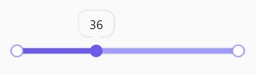

_Definition_: a *rangeField* is used for fields that must contain a value within a range.

[cols="3*", options="header"]
|===
|States|Properties|Intentions

|inRange
|maximum
|step

|outOfRange
|minimum
|
|===

Usage example : TODO
[source,groovy,indent=0]
[subs="verbatim,attributes"]
----
include::{codepath}/../../../../test/groovy/sc/tyro/doc/componentsTest.groovy[tags=rangefield]
----

==== PhoneField

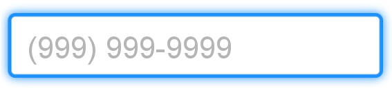

_Definition_: a *phoneField* is used for fields that must contain a telephone number.

Usage example : TODO

==== SearchField

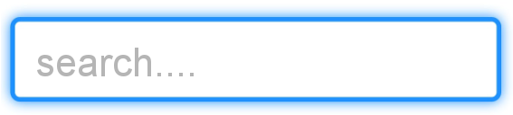

[cols="3*", options="header"]
|===
|States|Properties|Intentions

|
|length
|

|===

_Definition_: a *searchField* is used for search fields (a search field behaves like a regular text field).

Usage example : TODO

==== URLField

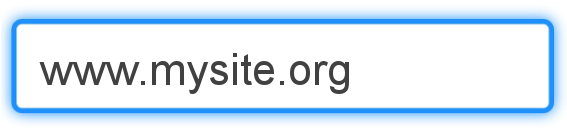

_Definition_: an *URLField* is used for fields that must contain a URL address.

Usage example : TODO

