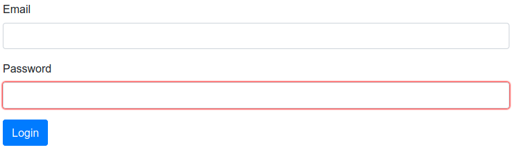

=== Form

_Definition_:  a *form* allows the user to collect user input.
Form elements are different types of input elements, checkboxes, radio buttons, submit buttons, and more.

[cols="3*", options="header"]
|===
|States|Properties|Intentions

|valid
|
|reset

|invalid
|
|submit

|===

[source,groovy,indent=0]
[subs="verbatim,attributes"]
----
include::{codepath}/../../../../test/groovy/sc/tyro/doc/componentsTest.groovy[tags=form]
----

