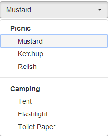
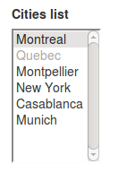

=== Item

*Item* is used for dropDowns and listBoxes.

 

[cols="3*", options="header"]
|===

|States|Properties|Intentions

|selected
|value
|select

|unselected
|
|unselect

|===

[source,groovy,indent=0]
[subs="verbatim,attributes"]
----
include::{codepath}/../../../../test/groovy/sc/tyro/doc/componentsTest.groovy[tags=item]
----
