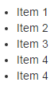

=== ListView

[.thumb]

image:../images/components/ListView-2.png[ListView-2, float=left]

_Definition_: a *listView* allows the user to display items in a list format (with bullet points or numbers, indentation,...).

[cols="3*", options="header"]
|===

|States|Properties|Intentions

|
|items, _number of items_
|

|===

Usage examples : TODO
[source,groovy,indent=0]
[subs="verbatim,attributes"]
----
include::{codepath}/../../../../test/groovy/sc/tyro/doc/componentsTest.groovy[tags=listview]
----
